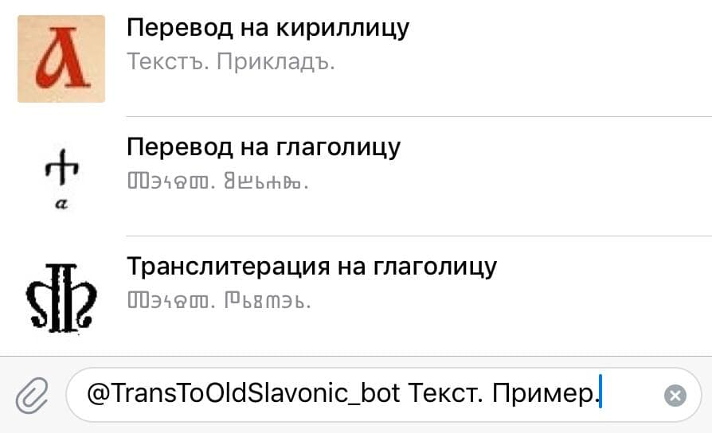
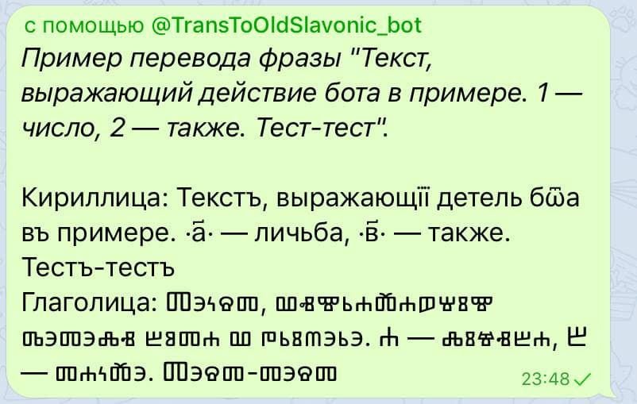
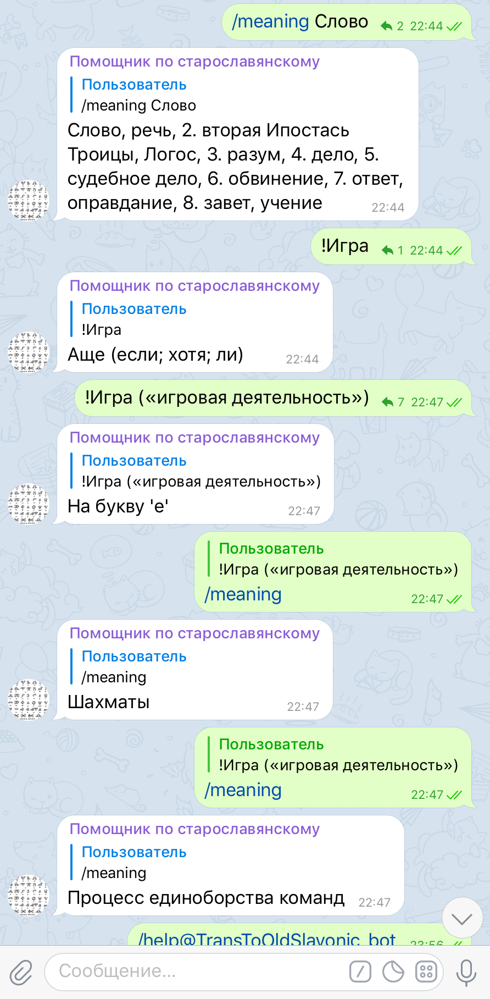

# Old-Slavonic-bot

*\[This README file may be partially outdated.\]*

*\[Also this may be a strange file.*\]

<!-- Only at public GitHub repository: can use Deploy to Heroku button with no explicit parameter. See: https://devcenter.heroku.com/articles/heroku-button -->

## Contents

 + [Описание](#about)
 + [Применение](#usage)
 + [Файлы и папки](#files)
 + [References](#references)

## Описание

Бот [@TransToOldSlavonic_bot](t.me/TransToOldSlavonic_bot) в Telegram.

Переводчик на [cтарославянский язык](https://ru.wikipedia.org/wiki/%D0%A1%D1%82%D0%B0%D1%80%D0%BE%D1%81%D0%BB%D0%B0%D0%B2%D1%8F%D0%BD%D1%81%D0%BA%D0%B8%D0%B9_%D1%8F%D0%B7%D1%8B%D0%BA). Доступные функции: перевод, транслитерация на алфавиты письма [старославянской кириллицы](https://ru.wikipedia.org/wiki/%D0%A1%D1%82%D0%B0%D1%80%D0%BE%D1%81%D0%BB%D0%B0%D0%B2%D1%8F%D0%BD%D1%81%D0%BA%D0%B0%D1%8F_%D0%BA%D0%B8%D1%80%D0%B8%D0%BB%D0%BB%D0%B8%D1%86%D0%B0) и [глаголицы](https://ru.wikipedia.org/wiki/%D0%93%D0%BB%D0%B0%D0%B3%D0%BE%D0%BB%D0%B8%D1%86%D0%B0). Подробнее: см. /help в боте [@TransToOldSlavonic_bot](t.me/TransToOldSlavonic_bot).

Лицензия: [MIT License](LICENSE).

Статья в Telegraph:
https://telegra.ph/Perevodchik-na-staroslavyanskij-02-28.

В версии 1.0.0 некоторые файлы отдельно вынесены [в папку контроля версий](meta/versions-controll) с удалением этих файлов в корне.

Начиная с версий (1.0.0+, [commit 16](https://github.com/1-1-1-1-1-1-1-1/Old-Slavonic-bot/commit/88eeaa768d4f2a382de0583ef23f162b91b60302) в GitHub), где также добавляются файлы контроля версий (meta/versions-controll), есть три версии: в библиотеках `telebot`, `aiogram`, `telethon`. Файлы/данные, записанные до этого момента, приоритетно считать не столь авторитетными, как после (начиная с) него.

ChangeLog (история версий): [ChangeLog.txt](meta/versions-controll/ChangeLog.txt).

## Применение

Перевод слова или текста (в режиме [inline](https://core.telegram.org/bots/inline)):

Команда `/meaning` (см. `/meaning help` в боте для подробного описания):

## Файлы и папки

* Some data: в папке [data/](data/).
* Файл с определением функций перевода и транслитерации: [functions.py](functions.py).

## References

### По функциям, работе бота

 * Работа функций транслитерации:
     - https://www.ponomar.net/files/gama2/p002.htm (Название: "§2. Употребление и произношение букв")
 * Про числа:
     - Общие сведения: http://lukianpovorotov.narod.ru/Folder_Pravoslavie/tserkovnoslavyanskiye_chisla.html
     - Подробности: http://konorama.ru/servisy/slacy/
     - Программа для конвертации чисел: http://info-7.ru/Titlo/Titlo.shtml (link to this was at Wikipedia, see prev. source)
 * Работа бота:
     - Режим inline:
         + https://core.telegram.org/bots/inline
     - Мануалы по режиму inline:
         + https://mastergroosha.github.io/telegram-tutorial/docs/lesson_07/,
         + https://mastergroosha.github.io/telegram-tutorial/docs/lesson_08/ <з
     - Telegram Bot API: https://core.telegram.org/bots/api
 * Git docs, partial: https://git-scm.com/book/ru/v2/Основы-Git-Создание-Git-репозитория/

### Heroku

 * Deployment: https://devcenter.heroku.com/categories/deployment
 * Creating a 'Deploy to Heroku' Button: https://devcenter.heroku.com/articles/heroku-button

### Telegram Bot API

Ссылка: https://core.telegram.org/bots/api.

 * Про `InlineKeyboardMarkup`:
 > Note: This will only work in Telegram versions released after 9 April, 2016.

 (*from the [Telegram Bot API]*)

 * Query's text:
 > Text of the query (up to 256 characters)

 (*from the [Telegram Bot API]*)

### Another

#### Documentations

 * Документация к `Telethon`: https://docs.telethon.dev/en/latest/
 * Документация к `aiogram`: https://docs.aiogram.dev/en/latest/
 * Документация к `telebot` (`pip`: `pyTelegramBotAPI`): https://github.com/eternnoir/pyTelegramBotAPI#pytelegrambotapi / https://pypi.org/project/pyTelegramBotAPI/
 * http://www.fabfile.org/ link to it was at prev. (dotenv.)

[Telegram Bot API]: https://core.telegram.org/bots/api

See also
--------

[meta/NOTES.md.txt](meta/NOTES.md.txt)
 
[up to top](#top)
