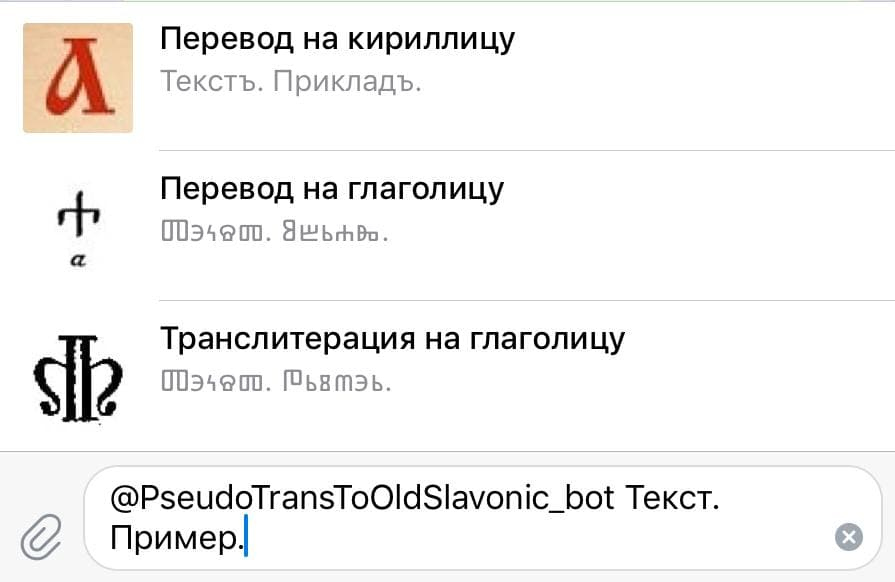

# Old-Slavonic-bot

<!-- only at public GitHub repository: -->
 

<!--  -->

# Contents
 + [About](#about)
 + [Usage](#usage)

# About

[MIT License](LICENSE)

Переводчик на старославянский язык.

Статья в Telegraph: 
https://telegra.ph/Perevodchik-na-staroslavyanskij-02-28
<!-- tests: -->
<!-- https://telegra.ph/Test-02-20-154 -->

# Usage

  <!-- !!! -->

# Files & folders

Some data: [data/](data/)

[up to top](#top)